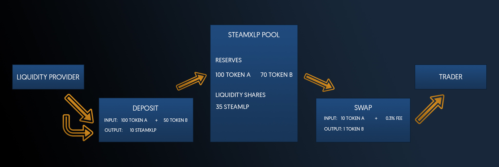

Rails Network Swap operates as an _automated liquidity protocol_, utilizing a [constant product formula](../protocol-overview/glossary#constant-product-formula) within a framework of immutable smart contracts on the Rails Network blockchain. This eliminates the necessity for trusted intermediaries, with a strong emphasis on **decentralization**, **censorship resistance**, and **security**.

Each pair, or smart contract within the Rails Network Swap, governs a liquidity pool consisting of two ERC-20 token reserves.

To participate as a liquidity provider (STEAMXLP), one can contribute an equivalent value of each token to a pool, receiving pool tokens in return. These pool tokens represent proportional shares of the total reserves and can be exchanged back for the underlying assets at any point.

The pairs serve as automated market makers, automatically facilitating exchanges between one token and another, maintaining the “constant product” formula, denoted as `x * y = k`. This equation ensures that the reserves' product (`k`) remains constant, with larger trades incurring progressively less favorable rates due to this invariant.

Rails Network Swap currently imposes a 0.30% fee on transactions, contributing to the pool's reserves and effectively increasing `k`, benefiting liquidity providers upon redemption of their pool tokens. Future adjustments may reduce this fee to 0.25%, allocating 0.05% for a protocol-wide levy.

Price discrepancies between the pair assets within the Rails Network Swap and external markets offer arbitrage opportunities, aligning the internal swap prices with the prevailing market prices.

# Further Exploration

For practical insights into token swapping and the swap lifecycle, refer to [Swaps](../core-concepts/swaps). For a deeper understanding of liquidity pools, visit [Pools](../core-concepts/pools).

For a comprehensive understanding of the underlying technology, explore [Smart Contracts](../../reference/smart-contracts/factory) on the Rails Network.